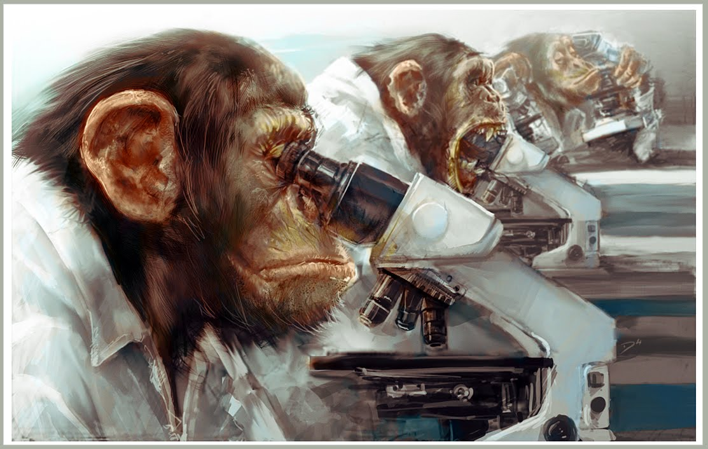

# And Then There Was One

## Introduction

And Then There Was One is a murder mystery in which a troop of monkeys live in a research lab peacefully passing their time collecting bananas. Sadly one monkey has gone bonkers! This monkey thrives off tranquilizing all of the other monkeys in the lab one at a time. Can the innocent monkeys discover which of their peers has gone mad and tranquilize the offending monkey before it's too late?

## Gameplay

At the beginning of the game one player is randomly assigned to be the murderer. The murderer tries to kill the other monkeys without arising the attention of the innocent monkeys. The murderous monkey wins if he/she kills all of the other monkeys. The innocent monkeys win if they can successfully identify the murderous monkey and tranquilize him/her.

### Rules

* Innocent monkeys must intake bananas (by simply running over them), otherwise they will die from banana-deficiency. The mad monkey is not required to eat bananas (instead living off of the thrill of tranquilizing his/her peers).
* If an innocent monkey incorrectly identifies the mad monkey, accidently tranquilizing another innocent monkey, both monkeys die.
  
### Controls

* **A:** left
* **D:** right
* **W:** forward
* **S:** backward
* **Space:** tranquilize
